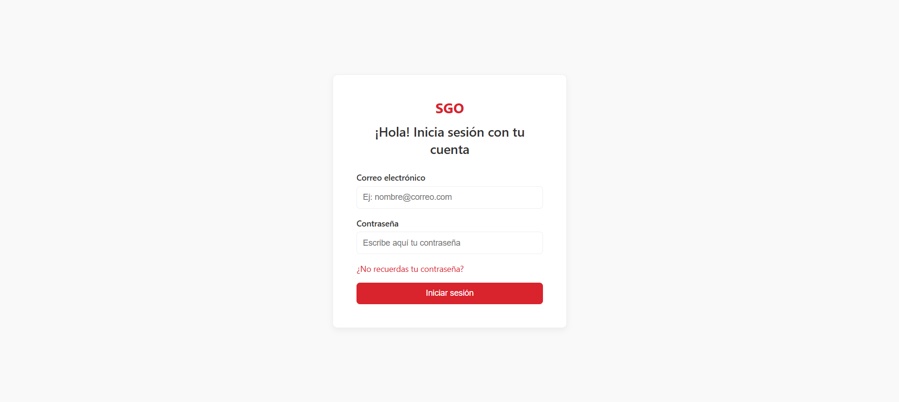
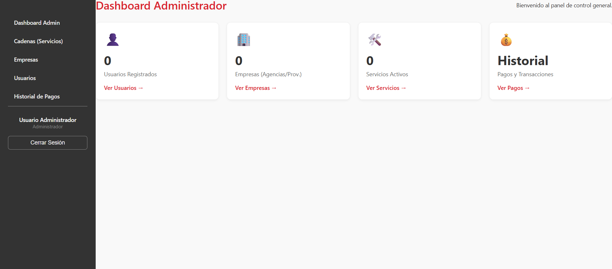
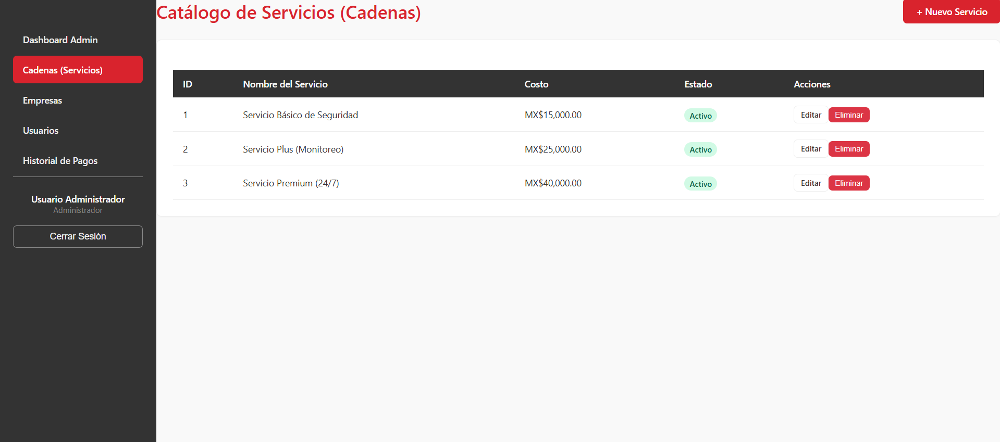
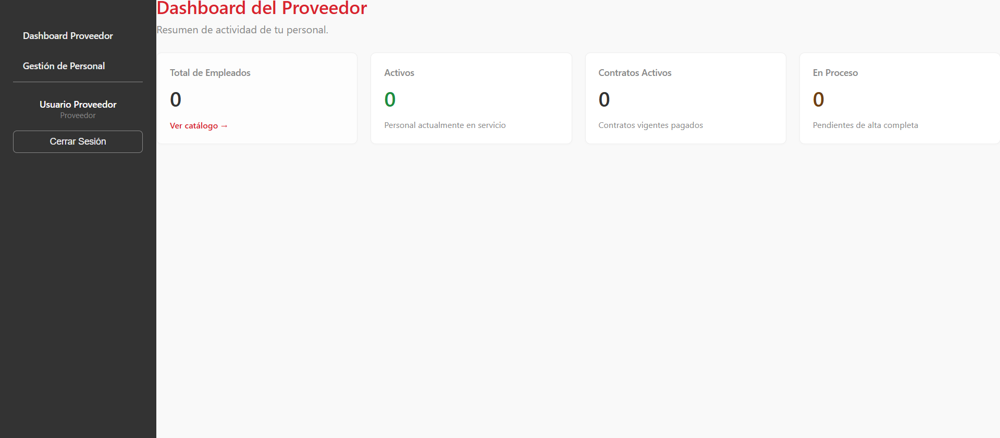
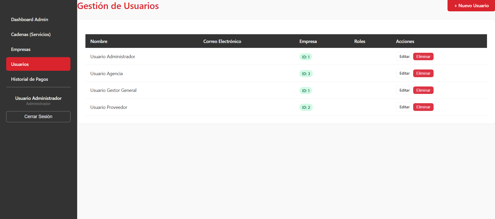
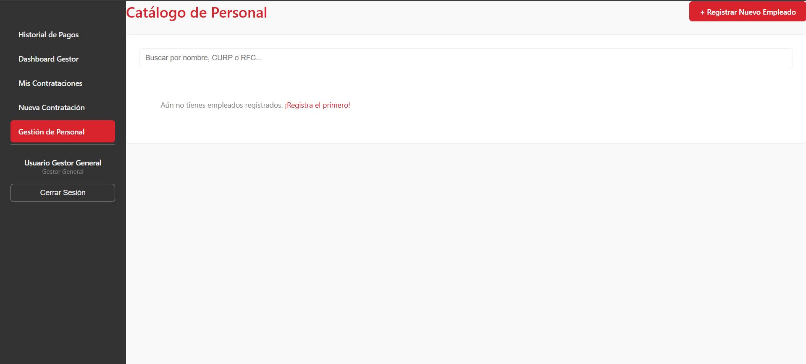

# SGO - Plataforma SaaS de Outsourcing y Gestión de Talento 💼☁️

> **Proyecto:** Plataforma SaaS (Software as a Service) para la gestión de subcontratación de personal entre Agencias y Proveedores.
> **Arquitectura:** MEAN/PEAN Stack (Postgres, Express, Angular, Node).
> **Modelo:** Basado en Suscripciones y Permisos Granulares.

## 📖 Arquitectura del Sistema
Este proyecto no es un gestor de usuarios tradicional. Es una solución **Multi-Tenant B2B** diseñada para orquestar la relación comercial entre empresas que buscan talento (Agencias) y empresas que lo suministran (Proveedores).

El núcleo del sistema se basa en una **Matriz de Permisos Dinámicos**. A diferencia de los roles estáticos, aquí las capacidades del usuario (ej. "Contratar", "Ver Reportes") dependen del **Paquete de Suscripción** contratado (Básico, Plus, Premium), lo que permite escalar el negocio monetizando funcionalidades específicas.

---

## 📦 Modelo de Negocio (SaaS Logic)

El sistema permite la creación dinámica de paquetes de servicio. Un "Gestor General" tiene acceso total, mientras que una "Agencia" con plan básico tiene funciones limitadas.

* **Gestión de Paquetes:** El administrador define qué permisos incluye cada nivel de suscripción y su costo.
* **Control de Acceso (ACL):** Middleware personalizado en Node.js que verifica no solo el rol, sino la vigencia y alcance de la suscripción antes de permitir una acción.

| Dashboard Administrativo | Configuración de Paquetes y Precios |
|:---:|:---:|
|  |  |

---

## 👥 Roles y Flujos de Trabajo

La plataforma gestiona ecosistemas complejos de usuarios con vistas personalizadas para cada uno:

### 1. El Proveedor (Supplier)
Dashboard enfocado en la operatividad. Su función principal es cargar su plantilla de empleados y monitorear qué contratos están activos.

### 2. La Agencia (Client) y Gestores
Usuarios que consumen el talento. Tienen acceso a herramientas de búsqueda, contratación y validación de personal, dependiendo de sus permisos adquiridos.

| Gestión de Usuarios (RBAC) | Catálogo de Talento y Contratación |
|:---:|:---:|
|  |  |

---

## 🛠 Stack Tecnológico & Desafíos

* **Frontend:** **Angular 16+** con RxJS para manejo de estado reactivo. Uso de *Guards* y *Interceptors* para manejar la seguridad de las rutas según los permisos del token JWT.
* **Backend:** API RESTful construida con **Node.js y Express**.
* **Base de Datos:** **PostgreSQL** modelada para soportar relaciones complejas (Usuarios <-> Roles <-> Permisos <-> Suscripciones).

### 🚀 Reto Técnico: Permisos Dinámicos
El mayor desafío fue desacoplar la lógica de "Roles" de la de "Permisos".
Implementé un sistema donde un usuario no tiene acceso a una ruta por ser "Gerente", sino porque su rol tiene asignado el permiso `CREATE_CONTRACT`. Esto permite que si el día de mañana se crea un plan "Gold", simplemente se asignan los permisos existentes a ese plan sin reescribir código en el backend.

---

### 📬 Contacto
